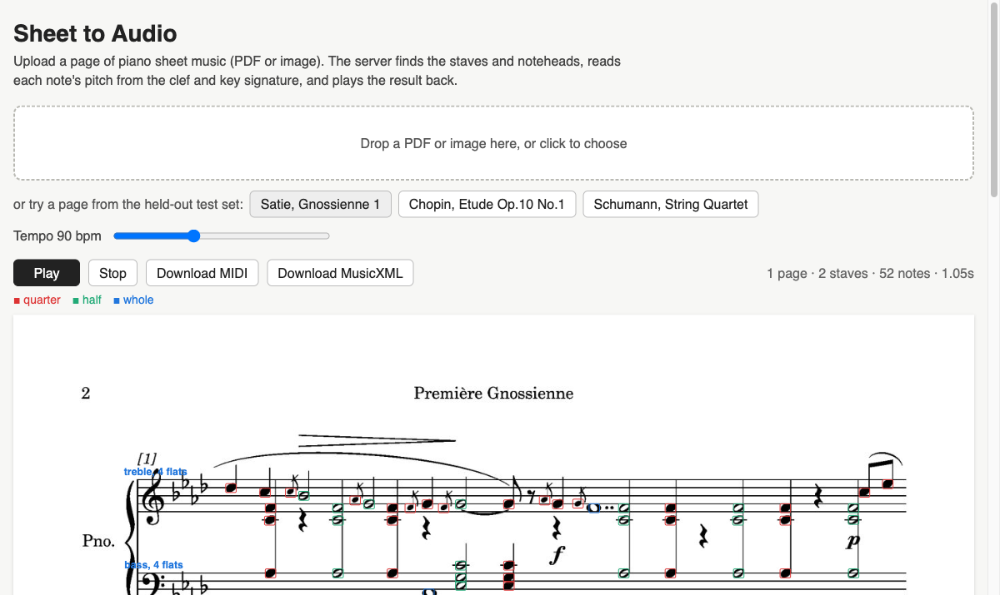

# Pitch Recognition and Note Detection from Sheet Music

Reads scanned piano sheet music, finds the noteheads, works out their pitch
and note type, and plays the page back. Started as the final project for
CSCI 1470 (Deep Learning) at Brown, then extended into a working
[web app](#extension-sheet-music-to-audio).

## Course project (Spring 2025)

We primarily worked in Kaggle, using two notebooks to manage all of our code.

[Working Notebook](https://www.kaggle.com/code/apoxieforest/brown-s25-final-project-draftgit)

[Final Notebook](https://www.kaggle.com/code/apoxieforest/brown-s25-final-notebook)

We never got GitHub properly linked so each group member made Kaggle "commits" instead.
The notebooks are checked in here as `brown-s25-final-notebook.ipynb` and
`brown-s25-final-project-draft.ipynb`, and the write-up is `written-report.pdf`.

### Dataset

[DoReMi](https://github.com/steinbergmedia/DoReMi)

### Reference Project

[oemer](https://github.com/BreezeWhite/oemer)

### Poster


## Extension: sheet music to audio

The course project ended with note types and pitches drawn on top of the
image. The original goal in the report was to hear the music, so after the
course I took the pipeline out of the notebooks, fixed what did not hold up
on piano scores, and built the rest of the way to playback.

**Live demo:** _link goes here once the Space is up_ (free tier, so the
first load can take a minute while the container wakes up)

Upload a PDF or image, or click one of the sample pages. The server returns
every note it found with a pitch and a start time; the page plays in the
browser with the notes highlighted as they sound, and the result can be
downloaded as MIDI or MusicXML.



### What changed

- **Measured against ground truth.** DoReMi labels every notehead with its
  MIDI pitch, onset and duration, so there is now an evaluation harness
  (`scripts/evaluate.py`) that scores detection, classification, clef, pitch
  and timing on six songs held out by *song*, not by page. The report's
  detection number was detected-count over labelled-count on three string
  quartet movements; it did not check which notes matched and was never run
  on piano music.
- **Notehead detection.** The morphological pipeline from the notebook found
  ~90% of heads on the quartet pages but far fewer on piano pages: hollow
  heads lost their outline during staff-line removal, and chords merged into
  blobs that were thrown out by the size filter before the watershed ever
  ran (so the watershed never did anything). It is kept as the baseline
  (`omr/segment.py`, with and without those two fixes) and replaced by a
  small U-Net (118k parameters) that predicts a heatmap of notehead centres
  (`omr/detector.py`).
- **Staff detection** now ignores anything that is not a page-wide
  horizontal run, and tolerates spurious rows when grouping lines into
  staves; the notebook's every-five-peaks grouping lost staves on pages
  with long beams.
- **Clefs and key signatures.** The report assumed treble clef everywhere.
  Two more small CNNs now read the clef (G/F/C, alto or tenor) and the
  accidentals after it, and accidentals in front of a note carry to the
  next barline.
- **Timing.** Notes are grouped into columns within each system so chords and
  both hands line up; a column lasts as long as its shortest note.
- **The two notehead CNNs from the report are unchanged in design** but
  retrained on fixed windows that are the same at training and inference
  time (the notebook trained on XML box crops and predicted on ellipse crops).
- **Serving.** Models are exported to ONNX so the container runs on
  onnxruntime without TensorFlow. FastAPI backend, React + Tone.js frontend,
  one Dockerfile.

### Results

Held-out test songs (Chopin Op.10/1, Satie Gnossienne 1, Schumann String
Quartet 1, Bach Goldberg Var. 16, Reger Improvisation 4, Mendelssohn Songs
Without Words 17), 160 pages, 7,743 labelled noteheads.
A detection counts when its centre falls inside the labelled box. Everything
after the first two rows is computed on matched noteheads only, and the same
four classifiers are used in every column; only the detector differs.
"notebook + fixes" is the notebook's segmentation with the watershed made
reachable and staff lines removed at their detected rows instead of by a
morphological opening.

| | notebook as-is | notebook + fixes | heatmap detector |
|---|---|---|---|
| detection precision / recall / F1 | 0.988 / 0.694 / 0.815 | 0.939 / 0.842 / 0.888 | 0.999 / 0.999 / 0.999 |
| recall on quarter / half / whole heads | 0.73 / 0.60 / 0.00 | 0.88 / 0.61 / 0.25 | 1.00 / 0.99 / 0.99 |
| quarter / half / whole class accuracy | 1.000 | 1.000 | 1.000 |
| half vs whole (hollow heads only) | 1.000 | 1.000 | 1.000 |
| staff assignment | 1.000 | 1.000 | 1.000 |
| clef accuracy (per staff) | 1.000 | 1.000 | 1.000 |
| pitch: letter + octave | 0.932 | 0.929 | 0.942 |
| pitch: exact MIDI (key sig. + accidentals) | 0.846 | 0.820 | 0.857 |
| left-to-right order of notes on a staff | 1.000 | 1.000 | 0.979 |
| simultaneous notes kept simultaneous | 0.953 | 0.947 | 0.890 |
| time per page (CPU) | 0.32 s | 0.73 s | 0.45 s |

Per-song numbers are in `results/`; `python scripts/results_table.py`
regenerates this table from them. The two timing rows are slightly lower
for the heatmap detector because it also finds the grace notes and dense
passages the baselines miss, and those are where the ordering goes wrong.

Where the remaining pitch errors come from, in order: mid-staff clef
changes (the clef is read once per staff; Reger's left hand switches between
treble and bass constantly), *8va* passages (Chopin), and accidentals in
dense chords being attributed to the wrong note or missed.

### What it does not do

Only quarter, half and whole noteheads are recognised, the same scope as the
report. Flags and beams are not read, so eighth and sixteenth notes play as
quarters, and rests are skipped. Grace notes and ornaments get detected and
played as notes. Clef changes and *8va* marks in the middle of a staff are
not read. Systems on a page are grouped by the barline joining them at the
left, which DoReMi cannot test since it renders one system per page.
Handwritten or skewed scans will break the staff detection, which relies on
the lines being level.

### Running it

```
python -m venv .venv && source .venv/bin/activate
pip install -r requirements.txt && pip install -e .
(cd web && npm install && npm run build)
uvicorn app.main:app --port 8000        # http://localhost:8000
```

The ONNX models in `models/` are enough to run the app. To retrain or
evaluate, download DoReMi into `data/` and see `docs/walkthrough.md`, which
also explains each stage in more detail.

```
python scripts/run_page.py page.png --midi out.mid --overlay out.png
python -m pytest
```

### Deploying

The Dockerfile builds the frontend and serves everything on port 7860, which
is what Hugging Face Spaces expects. Create a Space with the Docker SDK,
then:

```
git remote add hf https://huggingface.co/spaces/<user>/<space>
git push hf main
```

The YAML block at the top of this file is the Space configuration.

### Layout

```
omr/        pipeline package (staff, detector, segment, models, pitch, score, evaluate)
scripts/    build_dataset, train, evaluate, export_onnx, run_page
app/        FastAPI server
web/        React frontend
models/     ONNX weights
results/    evaluation output
tests/      unit tests
docs/       walkthrough
```
